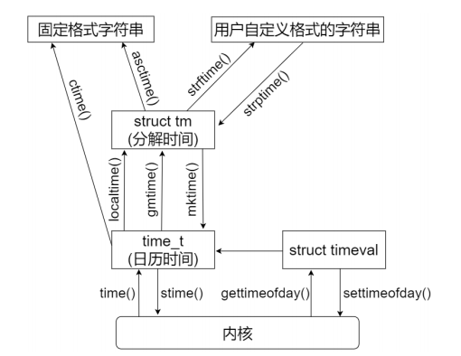

基础配置
====================

1 系统信息
----------------

.. code-block:: c

    # 获取系统信息
    #include <sys/sysinfo.h>
    struct sysinfo *info;
    ret = sysinfo(info);
    CK_RET(ret < 0, ret);

    # 获取本机名字
    #include <unistd.h>
    char hostname[20];
    ret = gethostname(hostname, sizeof(hostname));
    CK_RET(ret < 0, ret);

    # 获取并发进程等信息
    #include <unistd.h>
    LOG_I("每个用户的最大并发进程数: %ld\n", sysconf(_SC_CHILD_MAX));
    LOG_I("系统节拍率: %ld\n", sysconf(_SC_CLK_TCK));
    LOG_I("系统页大小: %ld\n", sysconf(_SC_PAGESIZE));

2 时间和日期
----------------

.. code-block:: C

    ######################################## 1 获取时间
    # 1.1 单位s, 返回的是从1970-01-01 UTC时间到现在的秒数
    #include <time.h>
    time_t t;
    t = time(NULL);

    # 1.2 获取时间 - 单位us
    #include <sys/time.h>
    struct timeval tval;
    ret = gettimeofday(&tval, NULL);
    CK_RET(ret < 0, ret);

    ######################################## 2 格式化时间
    # 2 将时间转换为字符串格式 
    #include <time.h>
    time_t tm;
    char tm_str[100] = {0};
    tm = time(NULL);
    ctime_r(&tm, tm_str);
    LOG_I("当前时间: %s", tm_str);

    # 2.1 将时间转换为固定格式字符串
    #include <time.h>
    time_t sec;
    struct tm local_t;
    char tm_str[100] = {0};
    sec = time(NULL);
    localtime_r(&sec, &local_t);
    asctime_r(&local_t, tm_str);
    LOG_I("本地时间: %s", tm_str);
    $ 本地时间: MON FEB 22 20:40:25 2021

    # 2.2 将时间转换为时间结构体 - 本地时间
    #include <time.h>
    struct tm t;
    time_t sec;
    sec = time(NULL);
    localtime_r(&sec, &t);
    LOG_I("当前时间: %d 年%d 月%d 日 %d:%d:%d", t.tm_year + 1900, t.tm_mon, t.tm_mday,
        t.tm_hour, t.tm_min, t.tm_sec);
    $ 当前时间: 2021年10月12日 11:11:11

    # 2.3 将时间转换为时间结构体 - GMT时间
    #include <time.h>
    struct tm local_t;
    struct tm utc_t;
    time_t sec;
    sec = time(NULL);
    gmtime_r(&sec, &utc_t);
    LOG_I("UTC 时间: %d 年%d 月%d 日 %d:%d:%d", utc_t.tm_year + 1900, utc_t.tm_mon, utc_t.tm_mday,
        utc_t.tm_hour, utc_t.tm_min, utc_t.tm_sec);
    $ UTC 时间: 2021年10月12日 11:11:11

    ######################################## 3 反向格式化时间
    # 制作时间, 将struct tm转换为time
    #include <time.h>
    struct tm local_t;
    mktime(&local_t);
    LOG_I("转换得到的秒数: %ld", mktime(&local_t));

    ######################################## 4 设置时间
    #include <sys/time.h>
    settimeofday(const struct timeval *tv, const struct timezone *tz);

3 随机数
----------------

.. code-block:: C

    #include <unistd.h>

    # 设置随机数种子
    int count;
    srand(time(NULL));
    count = rand();

4 延迟函数
----------------

.. code-block:: C

    # 延迟3秒
    #include <unistd.h>
    sleep(3);

    # 微秒延时
    usleep(1000);

    # 高精度延时
    #inclue <time.h>
    struct timespec request_t;
    request_t.tv_sec = 3;           // 设置延时3秒
    request_t.tv_nsec = 0;
    nanosleep(&request_t, NULL);

