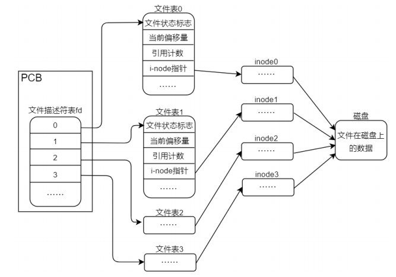
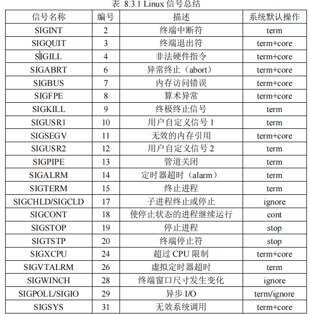

知识总结
========================

OVERVIEW
------------------------

   .. image:: .images/ov.png

缩略语
------------------------

================= ===================================================== =============================================================
IPC               inter process communication                           进程间通信
PCB               process control block                                 进程控制块
GMT               greenwich mean time                                   格林威治标准时间
UTC               coordinated universal time                            世界协调时间(世界标准时间、世界统一时间)
CST               china standard time                                   中国标准时间
================= ===================================================== =============================================================

1 文件编程
------------------------

1.1 文件处理原理
*****************

   文件存放在磁盘上称为之静态文件, 在磁盘上, 存储单位是扇区sector(512字节), 操作系统为了提高效率, 
   会按块block(8个扇区, 4K)读取。磁盘在格式化时分为数据区和inode区, 可通过 ``ls -i`` 来查看文件inode号。
   
   inode描述了文件大小、所有者、文件权限、时间戳、 数据块地址等信息。比如windows的快速格式化, 只是重建了inode区域。
   所以open时会先找到文件名对应的inode号, 再通过inode编号找到inode table中的inode结构体, 从而找到磁盘数据区, 
   将数据载入到内存, 称之为动态文件(内核缓冲区)。

   每个打开的文件用文件表结构体(含有inode指针)来记录, 文件表通过文件描述表 + 文件描述符来定位, 所以应用程序只需要
   文件描述符就能定位到具体文件了。打开相同的文件会生成相同的文件表，指向同一个动态文件, 但是文件表记录偏移各自维护

.. tip:: 
   
   用dup复制的文件描述符指向同一个文件表

1.2 文件模式
*****************

   文件模式一共有5个区域, O表示其他用户权限、G同组用户权限、U所有者权限、S文件特殊权限。
   文件类型既bcd-lsp类型
   

2.1文件IO与标准IO区别
***************************

   1. 文件IO无缓冲, 标准IO有全缓冲、行缓冲、不缓冲
   2. 文件IO属于系统调用, 标准IO属于标准C库

.. tip:: 
  
   - 全缓冲 : 填满标准IO缓冲区后才进行实际IO操作
   - 行缓冲 : 输入和输出终遇到换行符时才执行实际IO操作
   - 不缓冲 : 标准IO库不对字符进行缓存存储, 通常stderr是不带缓冲的
   - 标准IO缓冲区的大小定义在 ``stdio.h`` 中，用 ``BUFSIZ`` 表示
   - 标准IO中间没有fflush、fseek, 则在输出的后面不能直接跟随输入

2.2 文件类型
***************************

==== ============================
b    块设备文件
c    字符设备文件
d    目录文件
\-   普通文件
l    软连接
s    套接字文件
p    管道文件
==== ============================

2.4 缓冲更新进程
***************************

   内核的块缓冲由update的系统守护进程周期性调用(一般30s)sync函数, 来将数据刷到磁盘上

2.5 用户ID和组ID
***************************

   与一个进程关联的ID有6个或更多, 主要分为三部分 : 
   
      实际ID     : 实际用户ID、实际组ID 
      文件权限ID : 有效用户ID、有效组ID、附属组ID 
      运行时ID   : 保存的设置用户ID、保存的用户组ID 

   通常有效用户ID = 实际用户ID, 有效组ID = 实际组ID

2.6 文件访问权限
***************************

 每个文件有9个访问权限分别是 : 用户、组、其他的读、写、执行,  
 一般情况下有4组, 第一组是设置用户ID、设置组ID、粘着位

2.7 硬链接和软连接
***************************

   硬链接需要存在同一文件系统中, 软连接不需要

2.8 文件时间
***************************

   每个文件维护3个时间字段 : 
   1. 文件数据最后访问时间, read函数影响
   2. 文件数据最后修改时间, write函数影响
   3. i节点状态最后更改时间, chmod、chown函数影响

2.9 工作目录
***************************

   每个进程都有一个当前工作目录, 此目录是搜索所有相对路径的七点, 当用户登录到linux时, 
   当前工作目录时/etc/passwd中登录项的第6个字段, 既用户的起始目录, 当前目录时进程的一个属性, 
   起始目录是登录名的属性, 用chdir来更改当前工作目录

3 进程
------------------------

   每个进程用PCB来管理, 

   1. 每个进程都有唯一进程ID
   2. ID为0的进程通常是调度进程, 也被称为交换进程(swapper)
   3. ID为1的进程是init进程, 该进程会读取/etc/rc*文件和/etc/inittab和/etc/init.d中的文件
   4. 父进程打开文件描述符都会被复制到子进程中, 他们共享打开文件的页表
   5. 不要使用vfork, 现在只用fork
   6. 当一个进程正常或终止时, 内核就像父进程发送SIGCHLD信号, 父进程用wait等函数来接受
   7. 设计应用时，我们总是以最小特权模型, 来提高安全性
   8. 进程的调度通过nice值来调整, nice值越小, 优先级越高, 最小为0
   9. 进程还可以属于一个进程组, 每个进程组有唯一的ID, 每个进程组有一个组长进程
   10. 一个作业是几个进程的合集

3.1 fork特性
******************

   原本子进程是父进程的副本, 会复制父进程的数据、堆和栈。共享text段。但拷贝数据量大会降低效率,
   所以采用了写时拷贝, 这些区域父子进程共享, 内核将他们的全线改为只读, 当子进程想改变这些区域时, 
   内核只为修改区域的那块内存复制出来, 进而修改

3.2 进程的8终终止方式
************************

   正常终止:
   
   1. main函数中的return
   2. 调用exit()函数
   3. 调用_exit或_Exit函数
   4. 最后一个线程在程序中执行return
   5. 最后一个线程执行pthread_exit

   异常终止:

   1. 调用abort, 它产生SIGABRT信号
   2. 进程接受到某些信号时(信号)

3.3 信号
************************

   信号是进程的一种通知机制, 也称为软中断， 信号其实是编号从1-64的一组数, 用SIG开头的宏表示。信号是一个软中断,
   可以给我们提供一种停止当前执行流, 进而去执行另一部分代码的方法。其中, 1-31是基本信号, 32-64是实时信号。实时信号暂不关注。

3.4 进程的环境变量
************************

   每一个进程都有一组相关的环境变量, 以key=value形式的字符串存储, 比如shell终端下, 可以用env命令查看shell进程所有的环境
   变量

4 线程
------------------------

5 基础配置
------------------------

5.2 时间日期
****************

   GMT与UTC现在不做区分, 可以理解为UTC比GMT更准确, ``date -u`` 查看的就是UTC时间。全球被
   分为24个时区, 每一个时区经度为15度, 格林威治以本初子午线为0度经线(0时区), 将全球划分东西两半球。
   从东1区 - 东12区, 西1区 - 西12区, 而我国在东8区。相邻时区相差1小时。比如东8区比东7区早1小时。

   Linux系统会在开机从RTC硬件获取时间, 用jiffies全局变量记录系统启动后的节拍数, 通常100节拍/s(100HZ)
   我们要获取操作系统时间时, 就是利用jiffies来计算。

.. tip:: 
   
   中国国土面积很大, 我国最东和最西相差4、5个小时

5.3 随机数
****************

   c库生成的随机数是伪随机数, rand默认会用1作为随机数种子, 所以rand每次运行程序获得的随机序列是相同的, 
   因此在rand前用srand来设置随机数种子, 这样rand获取的随机数就会不同了

