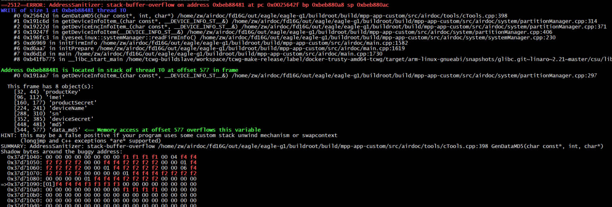

ASan
=================

1 ASan
------

1.1 介绍
********

结合编译器插桩和运行时快速内存检测工具, 主要用于检测代码中内存安全的问题, 可解如下问题

* 缓冲区溢出
* 空指针引用
* 悬垂指针
* 非法内存释放
* 栈变量在作用域失效后使用
* 栈变量在函数体返回后使用
* 全局变量初始化顺序检测(global-init-order)

1.2 原理
********

* Instrument静态插桩模块

对栈上对象、全局对象、动态分配的对象分配redzone

* runtime运行时库

替换malloc / free /memcpy /memset灯实现

1.3 使用例子
************

2 开启方法
==========

2.1 设置编译选项
----------------

.. code:: c

   -fsanitize=address,pointer-compare,pointer-subtract -fno-omit-frame-pointer

2.2 可能需要移植动态库
----------------------

.. code:: c

   libalibasan.so.2 => libasan.so.2.0.0
   libasan.so.2.0.0

3 参考文章
----------

https://zhuanlan.zhihu.com/p/382994002
